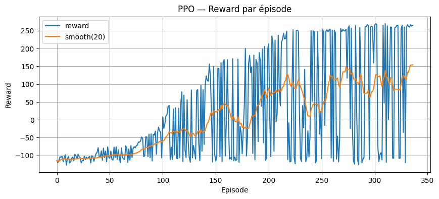
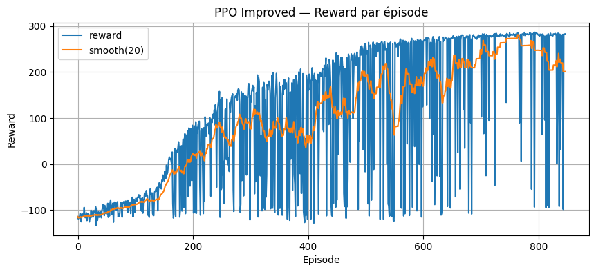
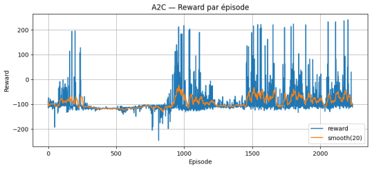
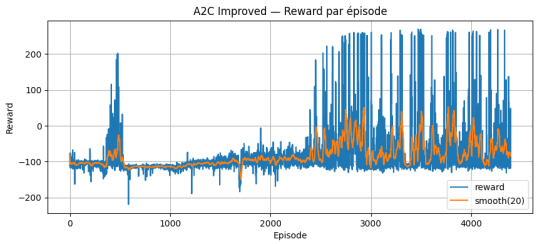
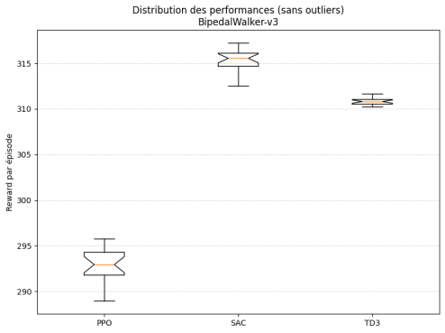

# Projet de Reinforcement Learning — BipedalWalker

## 1. Présentation générale du projet

Ce projet a pour objectif de mettre en pratique les notions de **Reinforcement Learning (RL)**
vues en cours à travers une étude expérimentale et comparative sur l’environnement
**BipedalWalker-v3** de Gymnasium, dédié au contrôle continu d’un robot bipède.

L’accent est mis sur :
- la compréhension de l’environnement,
- l’implémentation et l’entraînement de plusieurs algorithmes de RL,
- la comparaison rigoureuse de leurs performances,
- l’analyse critique des résultats obtenus.

---

## 2. Description de l’environnement

### Environnement utilisé
- **Nom** : BipedalWalker-v3  
- **Bibliothèque** : Gymnasium  
- **Type** : contrôle continu basé sur la physique (Box2D)

L’environnement simule un robot bipède devant apprendre à marcher de manière autonome
sans tomber, sur un terrain généré procéduralement.

---

### États (observations)
Les observations sont continues et décrivent :
- la posture du robot,
- les angles et vitesses des articulations,
- les contacts des pieds avec le sol,
- certaines informations liées au terrain.

---

### Actions
Les actions sont continues et correspondent aux **commandes des moteurs des jambes** :
- 4 actions réelles dans l’intervalle \([-1, 1]\),
- chaque action contrôle un couple moteur.

---

### Récompenses
La fonction de récompense combine :
- une récompense positive liée à la progression vers l’avant,
- des pénalités en cas de mouvements inefficaces,
- une forte pénalité en cas de chute.

Dans certaines extensions du projet, une mécanique de **collecte de récompenses**
(“coins”) est ajoutée via un wrapper Gymnasium afin de transformer la tâche en un
jeu d’optimisation séquentielle.

---

### Conditions de terminaison
Un épisode se termine lorsque :
- le robot chute,
- le nombre maximal de pas est atteint,
- ou que le parcours est complété.

---

## 3. Algorithmes implémentés

Plusieurs algorithmes de Reinforcement Learning ont été implémentés et évalués afin de
comparer différentes approches d’apprentissage dans un contexte de **contrôle continu**.
Ces algorithmes couvrent à la fois des méthodes **on-policy** et **off-policy**, ainsi que
des architectures actor-critic.

---

### PPO (Proximal Policy Optimization)

PPO est un algorithme **on-policy** de type actor-critic largement utilisé pour sa
stabilité et sa robustesse. Il repose sur une optimisation contrainte de la politique,
limitant l’amplitude des mises à jour afin d’éviter des changements trop brusques qui
pourraient dégrader les performances.

Dans ce projet, PPO est utilisé comme **algorithme de référence**.  
Deux versions sont étudiées :
- une version de base,
- une version améliorée avec ajustement des hyperparamètres (taille des batchs,
  nombre de pas par mise à jour, facteur de clipping).

PPO est bien adapté à l’environnement BipedalWalker-v3 car il gère efficacement les
espaces d’actions continus et présente une bonne stabilité d’apprentissage.

---

### A2C (Advantage Actor-Critic)

A2C est une version **synchrone** de l’algorithme Actor-Critic. Il apprend simultanément :
- une **politique** (actor), qui décide des actions à effectuer,
- une **fonction de valeur** (critic), qui estime la qualité des états visités.

L’apprentissage repose sur l’**avantage**, qui mesure l’écart entre la récompense
observée et la valeur estimée par le critic. Cette approche permet une convergence
rapide, mais peut être sensible au bruit et aux fluctuations de récompense.

Dans ce projet, A2C est étudié en version de base et en version améliorée afin
d’analyser l’impact du réglage des hyperparamètres sur la stabilité et la convergence.

---

### SAC (Soft Actor-Critic)

SAC est un algorithme **off-policy** basé sur le principe de **maximum d’entropie**.
En plus de maximiser la récompense cumulée, il encourage l’exploration en maximisant
l’entropie de la politique.

Cette caractéristique permet à SAC de maintenir une exploration plus riche et d’éviter
les politiques trop déterministes, ce qui est particulièrement utile dans des
environnements complexes comme BipedalWalker.

SAC utilise un **replay buffer**, ce qui améliore l’efficacité de l’apprentissage,
mais augmente également le coût mémoire et la complexité de l’implémentation.

---

### TD3 (Twin Delayed Deep Deterministic Policy Gradient)

TD3 est un algorithme **off-policy** conçu pour améliorer la stabilité de DDPG en
réduisant les biais d’estimation de la fonction de valeur. Il repose sur trois
principes clés :
- l’utilisation de **deux critics** (twin critics),
- des mises à jour retardées de la politique,
- l’ajout de bruit dans les actions cibles.

Ces mécanismes permettent de limiter la surestimation des valeurs et d’obtenir une
politique plus robuste, notamment dans des tâches de contrôle continu exigeantes.

Dans ce projet, TD3 est utilisé pour comparer les performances des algorithmes
off-policy avec celles des approches on-policy comme PPO et A2C.

---

Chaque algorithme est implémenté dans un **notebook séparé**, avec une structure
identique, afin de garantir une comparaison équitable des performances et des
comportements d’apprentissage.


---

## 4. Résultats et comparaisons

Chaque algorithme est évalué à l’aide des métriques suivantes :

- **Score moyen par épisode** (évaluation sur épisodes indépendants)
- **Score final** (moyenne des derniers épisodes d’entraînement)
- **Vitesse d’apprentissage** (nombre d’épisodes nécessaires pour atteindre un seuil de performance)
- **Stabilité** (écart-type des récompenses sur les derniers épisodes)
- **Temps d’entraînement**

### PPO

Les performances de PPO sont analysées à travers les courbes de récompense par épisode
pour la version de base et la version améliorée, ainsi qu’un tableau comparatif.

**PPO — version de base**  


**PPO — version améliorée**  


**Tableau comparatif PPO**  


---

### A2C

L’algorithme A2C est analysé dans sa version de base et dans une version améliorée.
Les courbes d’apprentissage illustrent la vitesse de convergence et la stabilité,
complétées par un tableau comparatif.

**A2C — version de base**  


**A2C — version améliorée**  


**Tableau comparatif A2C**  


---

### Comparaison globale

Une comparaison globale est réalisée entre les meilleures configurations de
**PPO, A2C, SAC et TD3**, à l’aide d’un graphique synthétique.



---

## 5. Analyse critique

Les expériences montrent que :
- PPO fournit une base solide mais peut être instable sans réglage précis,
- le **PPO amélioré** offre une meilleure stabilité et de meilleures performances
  au prix d’un temps d’entraînement plus élevé,
- **A2C** converge généralement plus rapidement, mais présente une variance plus élevée,
- **SAC** et **TD3**, en tant qu’algorithmes off-policy, offrent une exploration plus
  efficace et une meilleure robustesse, au prix d’une consommation mémoire plus importante.


Ces résultats illustrent l’importance du choix de l’environnement d’entraînement
et du réglage des hyperparamètres en Reinforcement Learning.

---

## 6. Utilisation des outils d’IA

L’utilisation d’outils d’IA (notamment **ChatGPT**) a été effectuée comme **outil
d’assistance** pour :
- clarifier certains concepts théoriques,
- structurer le code et la documentation,
- améliorer la lisibilité et l’organisation des notebooks.

---

## 7. Instructions d’exécution et de reproduction

### Prérequis
- Python ≥ 3.9
- gymnasium
- stable-baselines3
- numpy, pandas, matplotlib
- pygame (pour la visualisation)

### Installation
```bash
pip install gymnasium stable-baselines3 pygame numpy pandas matplotlib
